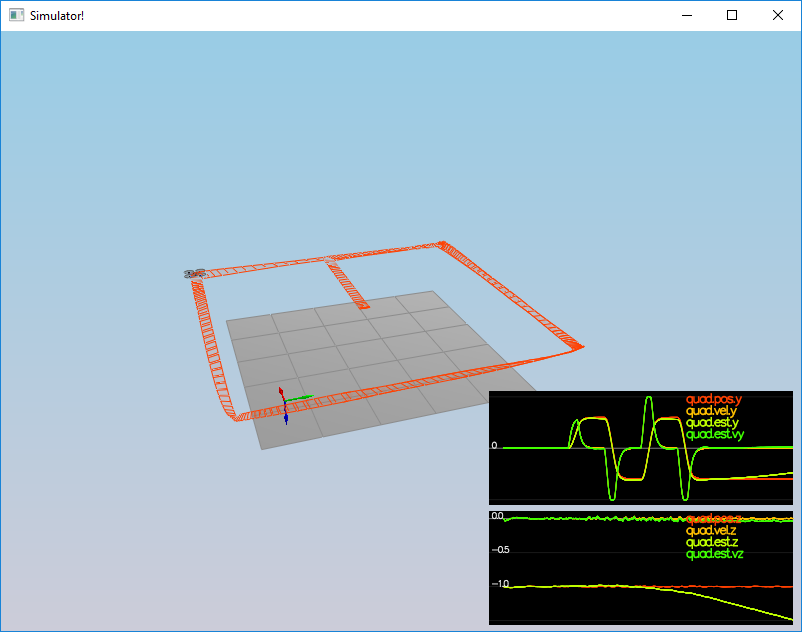
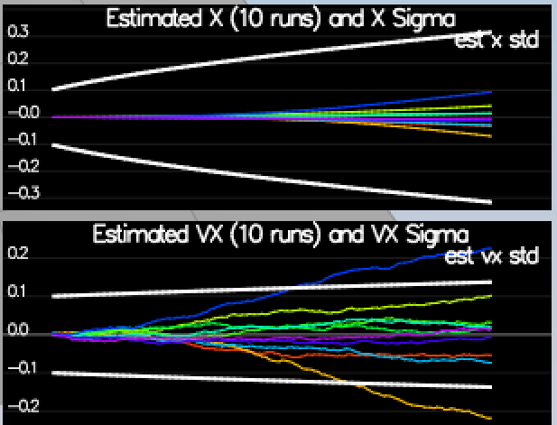

# Flying Cars - Project 4 - Implementing Estimator #

For easy navigation throughout this document, here is an outline:
 - [Simulator, Code and Config](#simulator-code-and-config)
 - [The scenarios](#the-scenarios)
 - [Results](#results-and-performance-metrics)
 - [Development environment setup](#development-environment-setup)

## Simulator, Code and Config ##

#### The Simulator ####

In the simulator window itself, you can right click the window to select between a set of different scenarios that are designed to test the different parts of your controller.

When the simulation is running, you can use the arrow keys on your keyboard to impact forces on your drone to see how your controller reacts to outside forces being applied.

There are a handful of keyboard / mouse commands to help with the simulator itself, including applying external forces on your drone to see how your controllers reacts!
 - Left drag - rotate
 - X + left drag - pan
 - Z + left drag - zoom
 - arrow keys - apply external force
 - C - clear all graphs
 - R - reset simulation
 - Space - pause simulation

The simulation (including visualization) is implemented in a single thread.  This is so that you can safely breakpoint code at any point and debug, without affecting any part of the simulation. Due to deterministic timing and careful control over how the pseudo-random number generators are initialized and used, the simulation should be exactly repeatable. This means that any simulation with the same configuration should be exactly identical when run repeatedly or on different machines. Vehicles are created and graphs are reset whenever a scenario is loaded. When a scenario is reset (due to an end condition such as time or user pressing the ‘R’ key), the config files are all re-read and state of the simulation/vehicles/graphs is reset -- however the number/name of vehicles and displayed graphs are left untouched.
Once you have the simulator running, you can observe the effects of the code changes in the simulator itself. In order to get the simulator up and running, your development environment will need to be set up. For instructions on how to set up your development environment, see the development environment setup portion of this README document. 

#### The Code ####

For this project, all the code was written in `src/QuadEstimatorEKF.cpp`. 

#### The Config ####

All the configuration files for the controller and the vehicle are in the `config` directory.  Changes were made to the `QuadEstimatorEKF.txt` text file and the text files for the respective tasks/scenarios. Any changes to this file can be observed in real time and the effect is shown in the quad(s) in the simulator. 

## The Scenarios ##

### Introduction - Hover (scenario 1) ###

When you run the simulator, you'll notice your quad is falling straight down.  This is due to the fact that the thrusts are simply being set to:
```
QuadControlParams.Mass * 9.81 / 4
```
If the mass doesn't match the actual mass of the quad, it'll fall down.  The `Mass` parameter in `QuadControlParams.txt` was tuned to make the vehicle more or less stay in the same spot.

With the proper mass set, the quad hovered more or less in the same spot as shown below.

<p align="center">

</p>

### Body rate and roll/pitch control (scenario 2) ###

In order to make the Quad fly the required trajectory, its body rate, roll and pitch has to be controlled. The rotational axis needs to be controlled so that the quad is stable and leveled in its attitude. 

The body rate control was implemened by making changes to the `GenerateMotorCommands()` , `BodyRateControl()`, in the QuadControl.cpp file in the src directory and tuning values in the QuadControlParams.txt file in the config directory.

The `GenerateMotorCommands()` method was modified in lines [56-103](https://github.com/manopaul/Flying-Cars-P3-Controller/blob/master/src/QuadControl.cpp#L56) to compute the thrust force for each motor and the collective thrust. l is computed as the distance from the vehicle (quad) origin to the motor over the square root of two or 1.414213562373095. kappa value is the drag/thrust ratio. 
Note that the force in z axis is inverted since D (down) in NED coordinates in pointing down. 
Thrusts for each motor (t1 to t4) is the computed as shown below 
```
    float t1 = momentCmd.x / l; // (L*(1.414213562373095/2));
    float t2 = momentCmd.y / l;  // (L*(1.414213562373095/2));
    float t3 =  - momentCmd.z/kappa;
    float t4 = collThrustCmd;
```
Desired thrust is computed used the equations below. Note, the rear left and rear right motors are swapped in order.
```
    cmd.desiredThrustsN[0] = (t1 + t2 + t3 + t4)/4.0f; // front left (f1)
    cmd.desiredThrustsN[1] = (-t1 + t2 - t3 + t4)/4.0f; // front right (f2)
    cmd.desiredThrustsN[2] = (t1 - t2 - t3 + t4)/4.0f; // rear left (f4)
    cmd.desiredThrustsN[3] = (-t1 - t2 + t3 + t4)/4.0f; // rear right (f3)
```
Desired thrust is then constrained to be within the minumum and maximum allowed motor thrurst values set in [QuadControlParams](https://github.com/manopaul/Flying-Cars-P3-Controller/blob/master/config/QuadControlParams.txt) text file in the config directory. Minimum thrust is set to .1 and Maximum thrust is set to 4.5
```
    cmd.desiredThrustsN[0] = CONSTRAIN(cmd.desiredThrustsN[0],minMotorThrust, maxMotorThrust);
    cmd.desiredThrustsN[1] = CONSTRAIN(cmd.desiredThrustsN[1],minMotorThrust, maxMotorThrust);
    cmd.desiredThrustsN[2] = CONSTRAIN(cmd.desiredThrustsN[2],minMotorThrust, maxMotorThrust);
    cmd.desiredThrustsN[3] = CONSTRAIN(cmd.desiredThrustsN[3],minMotorThrust, maxMotorThrust);
```

Once the motor thrust values were computed and constrained, the code in the function `BodyRateControl()` method was modified to implement a P controller that will output the desired moments for each of the 3 axes. It takes in the desired body rates (pqrCmd) and the current or estimated body rates (pqr) and computes the body rate error, which is then multiplied with the gain parameter (kpPQR) and moments of Inertia (I) to give us the desired moments along the x, y and z axes. 

The code shown below to compute desired moments are in lines [120-140](https://github.com/manopaul/Flying-Cars-P3-Controller/blob/master/src/QuadControl.cpp#L120):
```
    V3F momentCmd;
    V3F I, err, uBar;
    I.x = Ixx;
    I.y = Iyy;
    I.z = Izz;

    //I = V3F(Ixx,Iyy,Izz);
    //momentCmd = I * kpPQR * ( pqrCmd - pqr );

    err = pqrCmd - pqr; // target - actual
    uBar = kpPQR * err; // vertical acceleration
    momentCmd = uBar * I; // thrust command
    return momentCmd;
```

Finally the gain parameter value (kpPQR) in the  `QuadControlParams.txt` is tuned so that the vehicle stops spinning quickly and does not overshoot. The rotation of the vehicle about the roll (omega.x) gets controlled to 0 and the other rates remain zero as well, however the quad will fly off, since the angle is not controlled back to 0 yet. 

To prevent the vehicle from flying off, two of the three angles (roll and pitch) are coded to be controlled. The yaw angle is not controlled in this step. We get back to this later. 

The `RollPitchControl()` method lines [163-208](https://github.com/manopaul/Flying-Cars-P3-Controller/blob/master/src/QuadControl.cpp#L163) calculates the desired pitch and roll angle rates based on global lateral acceleration, the attitude of the quad and the desired collective thrust of the quad. The code in this method is modified to apply a P controller to elements of the rotation matrix from the body and world frame accelerations. The output from this method is the desired pitch and roll rates in the X and Y axes. Since the quad control should not exert thrust downwards, the Z element is left at the default value of zero. 

Note, since the collective thrust command is in Newtons, it is converted to acceleration first and constrained to the maximum tilt angles.

The `kpBank` parameter in `QuadControlParams.txt` is tuned to minimize settling time and to avoid too much overshoot.

The code for the RollPitchControl() method is shown below
```
    V3F pqrCmd;
    Mat3x3F R = attitude.RotationMatrix_IwrtB();

    float R11 = R(0,0);
    float R12 = R(0,1);
    float R13 = R(0,2); // b_x_a actual

    float R21 = R(1,0);
    float R22 = R(1,1);
    float R23 = R(1,2); // b_y_a actual

    float R33 = R(2,2);

    pqrCmd.z = 0.0;

    if (collThrustCmd > 0.f) {
        float c;
        float b_x_target, b_x_err, b_dot_x_c;
        float b_y_target, b_y_err, b_dot_y_c;
        float p_c, q_c;

        c = collThrustCmd / mass;

        b_x_target = - CONSTRAIN(accelCmd.x / c, -maxTiltAngle, maxTiltAngle);
        b_x_err = b_x_target - R13; //target - actual
        b_dot_x_c = kpBank * b_x_err;

        b_y_target =  - CONSTRAIN(accelCmd.y / c, -maxTiltAngle, maxTiltAngle);
        b_y_err = b_y_target - R23; // target  - actual
        b_dot_y_c = kpBank * b_y_err;

        p_c = (R21 * b_dot_x_c - R11 * b_dot_y_c) / R33;
        q_c = (R22 * b_dot_x_c - R12 * b_dot_y_c) / R33;

        pqrCmd.x = p_c;
        pqrCmd.y = q_c;
    } else {
        pqrCmd.x = 0.0;
        pqrCmd.y = 0.0;
    }

    return pqrCmd;
```
When successful, you will see the quad stabilize as shown below. 

<p align="center">

</p>

### Position/velocity and yaw angle control (scenario 3) ###

In this part, the position, altitude and yaw are controlled for the quad. For the simulation, you will use `Scenario 3`.  This will create 2 identical quads, one offset from its target point (but initialized with yaw = 0) and second offset from target point but yaw = 45 degrees.

Code is modified in the `AltitudeControl()`, `LateralPositionControl()` and `YawControl()` methods and the `kpPosZ` and `kpVelZ`, `kpVelXY`, `kpYaw` and the 3rd (z) component of the `kpPQR` parameters are tuned. 

To control the altitude, a PID controller was implemented in lines [231-258](https://github.com/manopaul/Flying-Cars-P3-Controller/blob/master/src/QuadControl.cpp#L231) in the `AltitudeControl()` method, as shown below. Upon determining the velocity errors using the current (posZ, velZ) and desired (posZCmd, velZCmd) vertical position and velocity in NED , the p, i, and d terms were computed and the desired vertical acceleration was computed using these. Gravity and quad rotation was factored in and the the collective thrust is constrained to maxAscentRate and maxDescentRate as set in the config file. 

The code for the `AltitudeControl()` method is shown below.

```
    float z_err, z_dot_err; // z_dot_err is velocity error
    float p_term, d_term, i_term;
    float b_z, u_bar_1, z_accel; //u_bar_1 is vertical acceleration target/desired & z_accel is vertical acceleration

    z_err = posZCmd - posZ;
    z_dot_err = velZCmd - velZ;
    integratedAltitudeError += z_err * dt;
    
    p_term = kpPosZ * z_err;
    i_term = KiPosZ * integratedAltitudeError;
    d_term = kpVelZ * z_dot_err;
    //d_term = kpVelZ * z_dot_err + velZ;
    
    u_bar_1 = p_term + d_term + i_term + accelZCmd;
    b_z = R(2,2);

    z_accel = (u_bar_1 - CONST_GRAVITY) / b_z;
    
    thrust = - mass * CONSTRAIN(z_accel, -maxAscentRate/dt, maxAscentRate/dt);
``` 

To calculate the desired desired horizontal acceleration, a PD controller is implemented using the desired lateral position (posCmd), velocity (velCmd), acceleration and current pose (pos and vel) of the quad, in lines [281-322](https://github.com/manopaul/Flying-Cars-P3-Controller/blob/master/src/QuadControl.cpp#L281) in the `LateralPositionControl()` method. The maximum Speed and Acceleration is normalized and limited to the constraint values in the config file (maxSpeedXY and maxAccelXY).

The code for the `LateralPositionControl()` method is shown below.
``` 
    float pos_x_err, pos_y_err;
    float vel_x_err, vel_y_err;
    float p_x, d_x, p_y, d_y; //PD controller variables
    
    pos_x_err = posCmd.x - pos.x; //posCmd[0] - pos[0];
    pos_y_err = posCmd.y - pos.y; //posCmd[1] - pos[1];
    
    if(velCmd.mag() > maxSpeedXY) {
        velCmd = velCmd.norm() * maxSpeedXY;
    }
    
    vel_x_err = velCmd.x - vel.x;
    vel_y_err = velCmd.y - vel.y;
    
    p_x = pos_x_err * kpPosXY;
    p_y = pos_y_err * kpPosXY;
    
    d_x = vel_x_err * kpVelXY;
    d_y = vel_y_err * kpVelXY;
    
    accelCmd.x = p_x + d_x + accelCmdFF.x;
    accelCmd.y = p_y + d_y + accelCmdFF.y;
    
    if (accelCmd.mag() > maxAccelXY) {
        accelCmd = accelCmd.norm() * maxAccelXY;
    }
    
    accelCmd.z = 0;
``` 

Now the `YawControl()` method is modified to implemeted just a P controller, in lines [338-356](https://github.com/manopaul/Flying-Cars-P3-Controller/blob/master/src/QuadControl.cpp#L338), as shown below to control the Yaw.
```
    float yaw_cmd_2_pi = 0;
    if ( yawCmd > 0 ) {
        yaw_cmd_2_pi = fmodf(yawCmd, 2 * F_PI);
    } else {
        yaw_cmd_2_pi = -fmodf(-yawCmd, 2 * F_PI);
    }
    float yaw_err = yaw_cmd_2_pi - yaw;
    if ( yaw_err > F_PI ) {
        yaw_err -= 2 * F_PI;
    } if ( yaw_err < -F_PI ) {
        yaw_err += 2 * F_PI;
    }
    yawRateCmd = kpYaw * yaw_err;
```

When successful, you should see the quad demonstrate the behavior shown below. 

<p align="center">

</p>

### Non-idealities and robustness (scenario 4) ###

In this part, we explore some of the non-idealities and robustness of the implemented controller. For this simulation, use `Scenario 4`.  The configuration of the 3 quads in this scenario are all different as described below.
 - The green quad has its center of mass shifted back
 - The orange vehicle is an ideal quad
 - The red vehicle is heavier than usual
The goal is to move all of these 3 quads one meter forward. 

The integral control implemented and tuned in the 'AltitudeControl()' method was useful to stabilize and control the 3 quads with different masses. 

Successfully the 3 quads were moved one meter forward as shown below.

<p align="center">

</p>


### Tracking trajectories ###

The final part is to test the performance of the quads to follow a trajectory. For this simulation, you will use `Scenario 5`. This scenario has two quadcopters:
 - the orange one is following `traj/FigureEight.txt`
 - the other one is following `traj/FigureEightFF.txt` - for now this is the same trajectory.  
 
The quads were able to successfully follow the trajectory as shown below. 
<p align="center">

</p>

## Results and Performance Metrics ##

All of the scenarios passed successfully as shown in the images below.

<p align="left">


[

</p>

## Development Environment Setup ##

Regardless of your development platform, the first step is to download or clone this repository.

 1. Clone the repository
 ```
 git clone https://github.com/udacity/FCND-Estimation-CPP.git
 ```
 
Once you have the code for the simulator, you will need to install the necessary compiler and IDE necessary for running the simulator.
Here are the setup and install instructions for each of the recommended IDEs for each different OS options:

This project will continue to use the C++ development environment you set up in the Controls C++ project.

### Windows ###

For Windows, the recommended IDE is Visual Studio.  Here are the steps required for getting the project up and running using Visual Studio.

1. Download and install [Visual Studio](https://www.visualstudio.com/vs/community/)
2. Select *Open Project / Solution* and open `<simulator>/project/Simulator.sln`
3. From the *Project* menu, select the *Retarget solution* option and select the Windows SDK that is installed on your computer (this should have been installed when installing Visual Studio or upon opening of the project).
4. Make sure platform matches the flavor of Windows you are using (x86 or x64). The platform is visible next to the green play button in the Visual Studio toolbar:


5. To compile and run the project / simulator, simply click on the green play button at the top of the screen.  When you run the simulator, you should see a single quadcopter, falling down.

### OS X ###

For Mac OS X, the recommended IDE is XCode, which you can get via the App Store.

1. Download and install XCode from the App Store if you don't already have it installed.
2. Open the project from the `<simulator>/project` directory.
3. After opening project, you need to set the working directory:
  1. Go to *(Project Name)* | *Edit Scheme*
  2. In new window, under *Run/Debug* on left side, under the *Options* tab, set Working Directory to `$PROJECT_DIR` and check ‘use custom working directory’.
  3. Compile and run the project. You should see a single quadcopter, falling down.

### Linux ###

For Linux, the recommended IDE is QtCreator.

1. Download and install QtCreator.
2. Open the `.pro` file from the `<simulator>/project` directory.
3. Compile and run the project (using the tab `Build` select the `qmake` option.  You should see a single quadcopter, falling down.

**NOTE:** You may need to install the GLUT libs using `sudo apt-get install freeglut3-dev`


### Advanced Versions ###

These are some more advanced setup instructions for those of you who prefer to use a different IDE or build the code manually.  Note that these instructions do assume a certain level of familiarity with the approach and are not as detailed as the instructions above.

#### CLion IDE ####

For those of you who are using the CLion IDE for developement on your platform, we have included the necessary `CMakeLists.txt` file needed to build the simulation.

#### CMake on Linux ####

For those of you interested in doing manual builds using `cmake`, we have provided a `CMakeLists.txt` file with the necessary configuration.

**NOTE: This has only been tested on Ubuntu 16.04, however, these instructions should work for most linux versions.  Also note that these instructions assume knowledge of `cmake` and the required `cmake` dependencies are installed.**

1. Create a new directory for the build files:

```sh
cd FCND-Controls-CPP
mkdir build
```

2. Navigate to the build directory and run `cmake` and then compile and build the code:

```sh
cd build
cmake ..
make
```

3. You should now be able to compile and run the estimation simulator.


# Estimation Project #


This README is broken down into the following sections:

 - [Setup](#setup) - the environment and code setup required to get started and a brief overview of the project structure
 - [The Tasks](#the-tasks) - the tasks you will need to complete for the project
 - [Tips and Tricks](#tips-and-tricks) - some additional tips and tricks you may find useful along the way
 - [Submission](#submission) - overview of the requirements for your project submission


## Setup ##

This project will continue to use the C++ development environment you set up in the Controls C++ project.

 1. Clone the repository
 ```
 git clone https://github.com/udacity/FCND-Estimation-CPP.git
 ```

 2. Import the code into your IDE like done in the [Controls C++ project](https://github.com/udacity/FCND-Controls-CPP#development-environment-setup)
 
 3. You should now be able to compile and run the estimation simulator just as you did in the controls project


### Project Structure ###

For this project, you will be interacting with a few more files than before.

 - The EKF is already partially implemented for you in `QuadEstimatorEKF.cpp`

 - Parameters for tuning the EKF are in the parameter file `QuadEstimatorEKF.txt`

 - When you turn on various sensors (the scenarios configure them, e.g. `Quad.Sensors += SimIMU, SimMag, SimGPS`), additional sensor plots will become available to see what the simulated sensors measure.

 - The EKF implementation exposes both the estimated state and a number of additional variables. In particular:

   - `Quad.Est.E.X` is the error in estimated X position from true value.  More generally, the variables in `<vehicle>.Est.E.*` are relative errors, though some are combined errors (e.g. MaxEuler).

   - `Quad.Est.S.X` is the estimated standard deviation of the X state (that is, the square root of the appropriate diagonal variable in the covariance matrix). More generally, the variables in `<vehicle>.Est.S.*` are standard deviations calculated from the estimator state covariance matrix.

   - `Quad.Est.D` contains miscellaneous additional debug variables useful in diagnosing the filter. You may or might not find these useful but they were helpful to us in verifying the filter and may give you some ideas if you hit a block.


#### `config` Directory ####

In the `config` directory, in addition to finding the configuration files for your controller and your estimator, you will also see configuration files for each of the simulations.  For this project, you will be working with simulations 06 through 11 and you may find it insightful to take a look at the configuration for the simulation.

As an example, if we look through the configuration file for scenario 07, we see the following parameters controlling the sensor:

```
# Sensors
Quad.Sensors = SimIMU
# use a perfect IMU
SimIMU.AccelStd = 0,0,0
SimIMU.GyroStd = 0,0,0
```

This configuration tells us that the simulator is only using an IMU and the sensor data will have no noise.  You will notice that for each simulator these parameters will change slightly as additional sensors are being used and the noise behavior of the sensors change.


## The Tasks ##

Once again, you will be building up your estimator in pieces.  At each step, there will be a set of success criteria that will be displayed both in the plots and in the terminal output to help you along the way.

Project outline:

 - [Step 1: Sensor Noise](#step-1-sensor-noise)
 - [Step 2: Attitude Estimation](#step-2-attitude-estimation)
 - [Step 3: Prediction Step](#step-3-prediction-step)
 - [Step 4: Magnetometer Update](#step-4-magnetometer-update)
 - [Step 5: Closed Loop + GPS Update](#step-5-closed-loop--gps-update)
 - [Step 6: Adding Your Controller](#step-6-adding-your-controller)


### Step 1: Sensor Noise ###

For the controls project, the simulator was working with a perfect set of sensors, meaning none of the sensors had any noise.  The first step to adding additional realism to the problem, and developing an estimator, is adding noise to the quad's sensors.  For the first step, you will collect some simulated noisy sensor data and estimate the standard deviation of the quad's sensor.

1. Run the simulator in the same way as you have before

2. Choose scenario `06_NoisySensors`.  In this simulation, the interest is to record some sensor data on a static quad, so you will not see the quad move.  You will see two plots at the bottom, one for GPS X position and one for The accelerometer's x measurement.  The dashed lines are a visualization of a single standard deviation from 0 for each signal. The standard deviations are initially set to arbitrary values (after processing the data in the next step, you will be adjusting these values).  If they were set correctly, we should see ~68% of the measurement points fall into the +/- 1 sigma bound.  When you run this scenario, the graphs you see will be recorded to the following csv files with headers: `config/log/Graph1.txt` (GPS X data) and `config/log/Graph2.txt` (Accelerometer X data).

3. Process the logged files to figure out the standard deviation of the the GPS X signal and the IMU Accelerometer X signal.

4. Plug in your result into the top of `config/6_Sensornoise.txt`.  Specially, set the values for `MeasuredStdDev_GPSPosXY` and `MeasuredStdDev_AccelXY` to be the values you have calculated.

5. Run the simulator. If your values are correct, the dashed lines in the simulation will eventually turn green, indicating you’re capturing approx 68% of the respective measurements (which is what we expect within +/- 1 sigma bound for a Gaussian noise model)

***Success criteria:*** *Your standard deviations should accurately capture the value of approximately 68% of the respective measurements.*

NOTE: Your answer should match the settings in `SimulatedSensors.txt`, where you can also grab the simulated noise parameters for all the other sensors.


### Step 2: Attitude Estimation ###

Now let's look at the first step to our state estimation: including information from our IMU.  In this step, you will be improving the complementary filter-type attitude filter with a better rate gyro attitude integration scheme.

1. Run scenario `07_AttitudeEstimation`.  For this simulation, the only sensor used is the IMU and noise levels are set to 0 (see `config/07_AttitudeEstimation.txt` for all the settings for this simulation).  There are two plots visible in this simulation.
   - The top graph is showing errors in each of the estimated Euler angles.
   - The bottom shows the true Euler angles and the estimates.
Observe that there’s quite a bit of error in attitude estimation.

2. In `QuadEstimatorEKF.cpp`, you will see the function `UpdateFromIMU()` contains a complementary filter-type attitude filter.  To reduce the errors in the estimated attitude (Euler Angles), implement a better rate gyro attitude integration scheme.  You should be able to reduce the attitude errors to get within 0.1 rad for each of the Euler angles, as shown in the screenshot below.


In the screenshot above the attitude estimation using linear scheme (left) and using the improved nonlinear scheme (right). Note that Y axis on error is much greater on left.

***Success criteria:*** *Your attitude estimator needs to get within 0.1 rad for each of the Euler angles for at least 3 seconds.*

**Hint: see section 7.1.2 of [Estimation for Quadrotors](https://www.overleaf.com/read/vymfngphcccj) for a refresher on a good non-linear complimentary filter for attitude using quaternions.**


### Step 3: Prediction Step ###

In this next step you will be implementing the prediction step of your filter.


1. Run scenario `08_PredictState`.  This scenario is configured to use a perfect IMU (only an IMU). Due to the sensitivity of double-integration to attitude errors, we've made the accelerometer update very insignificant (`QuadEstimatorEKF.attitudeTau = 100`).  The plots on this simulation show element of your estimated state and that of the true state.  At the moment you should see that your estimated state does not follow the true state.

2. In `QuadEstimatorEKF.cpp`, implement the state prediction step in the `PredictState()` functon. If you do it correctly, when you run scenario `08_PredictState` you should see the estimator state track the actual state, with only reasonably slow drift, as shown in the figure below:



3. Now let's introduce a realistic IMU, one with noise.  Run scenario `09_PredictionCov`. You will see a small fleet of quadcopter all using your prediction code to integrate forward. You will see two plots:
   - The top graph shows 10 (prediction-only) position X estimates
   - The bottom graph shows 10 (prediction-only) velocity estimates
You will notice however that the estimated covariance (white bounds) currently do not capture the growing errors.

4. In `QuadEstimatorEKF.cpp`, calculate the partial derivative of the body-to-global rotation matrix in the function `GetRbgPrime()`.  Once you have that function implement, implement the rest of the prediction step (predict the state covariance forward) in `Predict()`.

**Hint: see section 7.2 of [Estimation for Quadrotors](https://www.overleaf.com/read/vymfngphcccj) for a refresher on the the transition model and the partial derivatives you may need**

**Hint: When it comes to writing the function for GetRbgPrime, make sure to triple check you've set all the correct parts of the matrix.**

**Hint: recall that the control input is the acceleration!**

5. Run your covariance prediction and tune the `QPosXYStd` and the `QVelXYStd` process parameters in `QuadEstimatorEKF.txt` to try to capture the magnitude of the error you see. Note that as error grows our simplified model will not capture the real error dynamics (for example, specifically, coming from attitude errors), therefore  try to make it look reasonable only for a relatively short prediction period (the scenario is set for one second).  A good solution looks as follows:


Looking at this result, you can see that in the first part of the plot, our covariance (the white line) grows very much like the data.

If we look at an example with a `QPosXYStd` that is much too high (shown below), we can see that the covariance no longer grows in the same way as the data.



Another set of bad examples is shown below for having a `QVelXYStd` too large (first) and too small (second).  As you can see, once again, our covariances in these cases no longer model the data well.


***Success criteria:*** *This step doesn't have any specific measurable criteria being checked.*


### Step 4: Magnetometer Update ###

Up until now we've only used the accelerometer and gyro for our state estimation.  In this step, you will be adding the information from the magnetometer to improve your filter's performance in estimating the vehicle's heading.

1. Run scenario `10_MagUpdate`.  This scenario uses a realistic IMU, but the magnetometer update hasn’t been implemented yet. As a result, you will notice that the estimate yaw is drifting away from the real value (and the estimated standard deviation is also increasing).  Note that in this case the plot is showing you the estimated yaw error (`quad.est.e.yaw`), which is drifting away from zero as the simulation runs.  You should also see the estimated standard deviation of that state (white boundary) is also increasing.

2. Tune the parameter `QYawStd` (`QuadEstimatorEKF.txt`) for the QuadEstimatorEKF so that it approximately captures the magnitude of the drift, as demonstrated here:


3. Implement magnetometer update in the function `UpdateFromMag()`.  Once completed, you should see a resulting plot similar to this one:


***Success criteria:*** *Your goal is to both have an estimated standard deviation that accurately captures the error and maintain an error of less than 0.1rad in heading for at least 10 seconds of the simulation.*

**Hint: after implementing the magnetometer update, you may have to once again tune the parameter `QYawStd` to better balance between the long term drift and short-time noise from the magnetometer.**

**Hint: see section 7.3.2 of [Estimation for Quadrotors](https://www.overleaf.com/read/vymfngphcccj) for a refresher on the magnetometer update.**


### Step 5: Closed Loop + GPS Update ###

1. Run scenario `11_GPSUpdate`.  At the moment this scenario is using both an ideal estimator and and ideal IMU.  Even with these ideal elements, watch the position and velocity errors (bottom right). As you see they are drifting away, since GPS update is not yet implemented.

2. Let's change to using your estimator by setting `Quad.UseIdealEstimator` to 0 in `config/11_GPSUpdate.txt`.  Rerun the scenario to get an idea of how well your estimator work with an ideal IMU.

3. Now repeat with realistic IMU by commenting out these lines in `config/11_GPSUpdate.txt`:
```
#SimIMU.AccelStd = 0,0,0
#SimIMU.GyroStd = 0,0,0
```

4. Tune the process noise model in `QuadEstimatorEKF.txt` to try to approximately capture the error you see with the estimated uncertainty (standard deviation) of the filter.

5. Implement the EKF GPS Update in the function `UpdateFromGPS()`.

6. Now once again re-run the simulation.  Your objective is to complete the entire simulation cycle with estimated position error of < 1m (you’ll see a green box over the bottom graph if you succeed).  You may want to try experimenting with the GPS update parameters to try and get better performance.

***Success criteria:*** *Your objective is to complete the entire simulation cycle with estimated position error of < 1m.*

**Hint: see section 7.3.1 of [Estimation for Quadrotors](https://www.overleaf.com/read/vymfngphcccj) for a refresher on the GPS update.**

At this point, congratulations on having a working estimator!

### Step 6: Adding Your Controller ###

Up to this point, we have been working with a controller that has been relaxed to work with an estimated state instead of a real state.  So now, you will see how well your controller performs and de-tune your controller accordingly.

1. Replace `QuadController.cpp` with the controller you wrote in the last project.

2. Replace `QuadControlParams.txt` with the control parameters you came up with in the last project.

3. Run scenario `11_GPSUpdate`. If your controller crashes immediately do not panic. Flying from an estimated state (even with ideal sensors) is very different from flying with ideal pose. You may need to de-tune your controller. Decrease the position and velocity gains (we’ve seen about 30% detuning being effective) to stabilize it.  Your goal is to once again complete the entire simulation cycle with an estimated position error of < 1m.

**Hint: you may find it easiest to do your de-tuning as a 2 step process by reverting to ideal sensors and de-tuning under those conditions first.**

***Success criteria:*** *Your objective is to complete the entire simulation cycle with estimated position error of < 1m.*


## Tips and Tricks ##

 - When it comes to transposing matrices, `.transposeInPlace()` is the function you want to use to transpose a matrix

 - The [Estimation for Quadrotors](https://www.overleaf.com/read/vymfngphcccj) document contains a helpful mathematical breakdown of the core elements on your estimator

## Submission ##

For this project, you will need to submit:

 - a completed estimator that meets the performance criteria for each of the steps by submitting:
   - `QuadEstimatorEKF.cpp`
   - `config/QuadEstimatorEKF.txt`

 - a re-tuned controller that, in conjunction with your tuned estimator, is capable of meeting the criteria laid out in Step 6 by submitting:
   - `QuadController.cpp`
   - `config/QuadControlParams.txt`

 - a write up addressing all the points of the rubric

## Authors ##

Thanks to Fotokite for the initial development of the project code and simulator.
