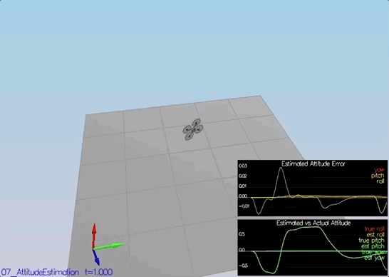
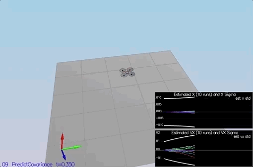
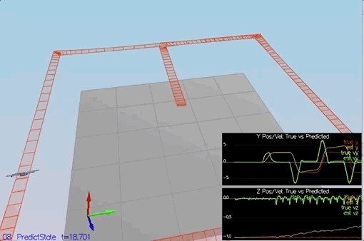

# Flying Cars - Project 4 - Implementing Extended Kalman Filter (EKF) Estimator #

For easy navigation throughout this document, here is an outline:
 - [Simulator, Code and Config](#simulator-code-and-config)
 - [The Scenarios](#the-scenarios)
 - [Development Environment Setup](#development-environment-setup)

## Simulator, Code and Config ##

#### The Simulator ####

In the simulator window itself, you can right click the window to select between a set of different scenarios that are designed to test the different parts of your controller.

When the simulation is running, you can use the arrow keys on your keyboard to impact forces on your drone to see how your controller reacts to outside forces being applied.

There are a handful of keyboard / mouse commands to help with the simulator itself, including applying external forces on your drone to see how your controllers reacts!
 - Left drag - rotate
 - X + left drag - pan
 - Z + left drag - zoom
 - arrow keys - apply external force
 - C - clear all graphs
 - R - reset simulation
 - Space - pause simulation

The simulation (including visualization) is implemented in a single thread.  This is so that you can safely breakpoint code at any point and debug, without affecting any part of the simulation. Due to deterministic timing and careful control over how the pseudo-random number generators are initialized and used, the simulation should be exactly repeatable. This means that any simulation with the same configuration should be exactly identical when run repeatedly or on different machines. Vehicles are created and graphs are reset whenever a scenario is loaded. When a scenario is reset (due to an end condition such as time or user pressing the ‘R’ key), the config files are all re-read and state of the simulation/vehicles/graphs is reset -- however the number/name of vehicles and displayed graphs are left untouched.
Once you have the simulator running, you can observe the effects of the code changes in the simulator itself. In order to get the simulator up and running, your development environment will need to be set up. For instructions on how to set up your development environment, see the development environment setup portion of this README document. 

#### The Code ####

For this project, all the code to implement the Extended Kalman Filter (EKF) estimator was written in `src/QuadEstimatorEKF.cpp`. 

 - The EKF implementation exposes both the estimated state and a number of additional variables. In particular:

   - `Quad.Est.E.X` is the error in estimated X position from true value.  More generally, the variables in `<vehicle>.Est.E.*` are relative errors, though some are combined errors (e.g. MaxEuler).

   - `Quad.Est.S.X` is the estimated standard deviation of the X state (that is, the square root of the appropriate diagonal variable in the covariance matrix). More generally, the variables in `<vehicle>.Est.S.*` are standard deviations calculated from the estimator state covariance matrix.

   - `Quad.Est.D` contains miscellaneous additional debug variables useful in diagnosing the filter. 

#### The Config ####

All the configuration files for the controller and the vehicle are in the `config` directory. Parameters for tuning the EKF are in the parameter file `QuadEstimatorEKF.txt`. In the `config` directory, in addition to finding the configuration files for your controller and your estimator, you will also see configuration files for each of the simulations.  

Changes were made to the `QuadEstimatorEKF.txt` text file and the text files for the respective tasks/scenarios. As an example, if we look through the configuration file for scenario 07, we see the following parameters controlling the sensor:

```
# Sensors
Quad.Sensors = SimIMU
# use a perfect IMU
SimIMU.AccelStd = 0,0,0
SimIMU.GyroStd = 0,0,0
```

This configuration tells us that the simulator is only using an IMU and the sensor data will have no noise.  You will notice that for each simulator these parameters will change slightly as additional sensors are being used and the noise behavior of the sensors change.

Any changes to this file can be observed in real time and the effect is shown in the quad(s) in the simulator. 

## The Scenarios ##

 - [1: Sensor Noise](#1-sensor-noise-scenario-06_noisysensors)
 - [2: Attitude Estimation](#2-attitude-estimation-scenario-07_attitudeestimation)
 - [3: Prediction](#3-prediction-scenario-08_predictstate-and-scenario-09_predictioncov)
 - [4: Magnetometer Update](#4-magnetometer-update-scenario-10_magupdate)
 - [5: GPS Update](#5-gps-update-scenario-11_gpsupdate)
 - [6: Update Controller](#6-update-controller)

### 1: Sensor Noise (scenario `06_NoisySensors`) ###

In order to make the quadcopter realistic, sensor noise had to be factored in. After running the simulator for the Sensor Noise scenario, the GPS X data and Accelerometer X data, which were recorded respectively as Graph 1 and Graph 2 in the log directory, was processed to determine the standard deviation. Graph 1 and Graph 2 were comma seprated value (csv) files. 

Each of these csv files were imported in Microsoft Excel program and the standard deviation was computed using Excel's built in function (STDEV). Figures below show this calculation.


Then standard deviation values was then plugged into the `config/6_Sensornoise.txt`, specifically as the values for `MeasuredStdDev_GPSPosXY` and `MeasuredStdDev_AccelXY` and the simulation was run again. 

It was observed that the standard deviations accurately captured the value of approximately 68% of the respective measurements as shown in the clip below.


### 2: Attitude Estimation (scenario `07_AttitudeEstimation`) ###

Upon determining the sensor noise and calculating it standard deviation towards state estimation the next step was the improve the complementary filter-type attitude filter with a better rate gyro attitude integration scheme. Section 7.1.2 of the [Estimation for Quadrotors](https://www.overleaf.com/read/vymfngphcccj) was used to start implementing a non-liner complimentary attitude filter using quaternions. 

The `UpdateFromIMU()` function in the `QuadEstimatorEKF.cpp` file was modified to calculate the pitch and roll angles by defining a quaternion for the euler angles for φ, θ and ψ using state. The built in IntegrateBodyRate method of the Quaternion was used to impove the performance when predicting the pitch and roll angles.

The code shown below to compute pitch and roll angles are in lines [102-112](src/QuadEstimatorEKF.cpp#L102) of the `QuadEstimatorEKF.cpp`:
```
    Quaternion<float> qt = Quaternion<float>::FromEuler123_RPY(rollEst, pitchEst, ekfState(6));
    
    //Roll, Pitch and Yaw predicted using Quaternions after converting from Euler angles
    qt.IntegrateBodyRate(gyro, dtIMU);
    float predictedRoll = qt.Roll();
    float predictedPitch = qt.Pitch();
    ekfState(6) = qt.Yaw();
```

Upon implementing these code changes and running the Attitude estimation simulation again, it was observed that the estimated attitude (Euler Angles) was within 0.1 rad for each of the Euler angles for atleast 3 seconds as shown below.



### 3: Prediction (scenario `08_PredictState` and scenario `09_PredictionCov`) ###

The next step was to implement the prediction step of your filter. 

A partial derivative of the body-to-global rotation matrix (RGB matrix) was implemented in the `GetRbgPrime()` method in the `QuadEstimatorEKF.cpp` file. The equation is shown below. 


The code shown below to implement the RGB Matrix are in lines [189-220](src/QuadEstimatorEKF.cpp#L189) of the `QuadEstimatorEKF.cpp`:

```
    //phi
    float sinRoll = sin(roll);
    float cosRoll = cos(roll);
    //theta
    float sinPitch = sin(pitch);
    float cosPitch = cos(pitch);
    //psi
    float sinYaw = sin(yaw);
    float cosYaw = cos(yaw);
    
    RbgPrime(0,0) = - cosPitch * sinYaw;
    RbgPrime(0,1) = - sinRoll * sinPitch  * sinYaw - cosPitch - cosYaw;
    RbgPrime(0,2) = - cosRoll * sinPitch * sinYaw + sinRoll * cosYaw;
    
    RbgPrime(1,0) = cosPitch * cosYaw;
    RbgPrime(1,1) = sinRoll * sinPitch * cosYaw - cosRoll * sinYaw;
    RbgPrime(1,2) = cosRoll * sinPitch * cosYaw + sinRoll * sinYaw;
```

Upon implementing this function, the `Predict()` function wsa modified to predict the state covariance forward by running the covariance prediction scenario and tuning the `QPosXYStd` and the `QVelXYStd` process parameters in `QuadEstimatorEKF.txt`. This was to try to capture the magnitude of the error.

The code shown below to predict covariance are in lines [232-291](src/QuadEstimatorEKF.cpp#L232) of the `QuadEstimatorEKF.cpp`:

```
    MatrixXf A(3,1);
    A(0,0) = accel.x * dt;
    A(1,0) = accel.y * dt;
    A(2,0) = accel.z * dt;
    
    MatrixXf B = RbgPrime * A;
    
    gPrime(0,3) = dt;
    gPrime(1,4) = dt;
    gPrime(2,5) = dt;
    
    gPrime(3,6) = B(0,0);
    gPrime(4,6) = B(1,0);
    gPrime(5,6) = B(2,0);
    
    ekfCov = gPrime * ekfCov * gPrime.transpose() + Q;
```

The follow covariance prediction was observed



The predict covariance function calls the PredictState() function, which was modified to take into account accelerations and velocities. The accelerations that are input into this method (accel values) are body frame accelerations and so they needed to be converted to inertial frame values by calling the Rotate_BtoI(accel) function as shown below. Gravity of -9.8 m/s^2 was factored in as well. 

```
    V3F acc = attitude.Rotate_BtoI(accel) + V3F(0,0,-9.81f); //accounting for gravity
    
    predictedState(0) += ekfState(3) * dt;
    predictedState(1) += ekfState(4) * dt;
    predictedState(2) += ekfState(5) * dt;
    predictedState(3) += acc.x * dt;
    predictedState(4) += acc.y * dt;
    predictedState(5) += acc.z * dt;
```

This is implemented in lines [150-187](src/QuadEstimatorEKF.cpp#L150)

When this code was run, it was observed that the estimator state tracked the actual state with only a reasonably slow drift as shown below. 



### 4: Magnetometer Update (scenario `10_MagUpdate`) ###

Up until now, we've only used the accelerometer and gyro for our state estimation.  In this step, information from the magnetometer to improve your filter's performance in estimating the vehicle's heading is added. The parameter `QYawStd` in the `QuadEstimatorEKF.txt` file was tuned to better balance the long term drift and short-time noise from the magnetometer. The function `UpdateFromMag()` was also updated to estimate the vehicle's heading. 

Section 7.3.2 of the [Estimation for Quadrotors](https://www.overleaf.com/read/vymfngphcccj) was used to implement the magnetometer update. 

Upon implementing these code changes, in lines [330-359](src/QuadEstimatorEKF.cpp#L330), the following was observed. 


### 5: GPS Update (scenario `11_GPSUpdate`) ###

Even though we have implemented an ideal estimator and and ideal IMU, the quad is seen to the drifting away smce GPS is not taken into account. As per the instructions, first I turned off the ideal estimator configuration setting (`Quad.UseIdealEstimator`) and then commented out the realistic IMU (as shown below) in the `config/11_GPSUpdate.txt` file.
```
#SimIMU.AccelStd = 0,0,0
#SimIMU.GyroStd = 0,0,0
```
Then I implemented a simple loop construct in the `UpdateFromGPS()` (as shown below) method to implement EKF using GPS update and re-ran the simulation. Lines [293-328](src/QuadEstimatorEKF.cpp#L293) show the code for implmenting this GPS update. 

    for ( int i = 0; i < 6; i++) {
        zFromX(i) = ekfState(i);
        hPrime(i,i) = 1;
    }

The following was observed with an estimated position error of < 1m. for the entire simulation. 


### 6: Update Controller ###

The `QuadController.cpp` and `QuadControlParams.txt` were replaced with the files developed in the Controller project and all the scenarios were successfully run. 


### 6: Results ### 
The videos of each of the above mentioned scenarios can be found in the [videos](videos) directory.

## Development Environment Setup ##

Regardless of your development platform, the first step is to download or clone this repository.

 1. Clone the repository
 ```
 git clone https://github.com/udacity/FCND-Estimation-CPP.git
 ```
 
Once you have the code for the simulator, you will need to install the necessary compiler and IDE necessary for running the simulator.
Here are the setup and install instructions for each of the recommended IDEs for each different OS options:

This project will continue to use the C++ development environment you set up in the Controls C++ project.

### Windows ###

For Windows, the recommended IDE is Visual Studio.  Here are the steps required for getting the project up and running using Visual Studio.

1. Download and install [Visual Studio](https://www.visualstudio.com/vs/community/)
2. Select *Open Project / Solution* and open `<simulator>/project/Simulator.sln`
3. From the *Project* menu, select the *Retarget solution* option and select the Windows SDK that is installed on your computer (this should have been installed when installing Visual Studio or upon opening of the project).
4. Make sure platform matches the flavor of Windows you are using (x86 or x64). The platform is visible next to the green play button in the Visual Studio toolbar:


5. To compile and run the project / simulator, simply click on the green play button at the top of the screen.  When you run the simulator, you should see a single quadcopter, falling down.

### OS X ###

For Mac OS X, the recommended IDE is XCode, which you can get via the App Store.

1. Download and install XCode from the App Store if you don't already have it installed.
2. Open the project from the `<simulator>/project` directory.
3. After opening project, you need to set the working directory:
  1. Go to *(Project Name)* | *Edit Scheme*
  2. In new window, under *Run/Debug* on left side, under the *Options* tab, set Working Directory to `$PROJECT_DIR` and check ‘use custom working directory’.
  3. Compile and run the project. You should see a single quadcopter, falling down.

### Linux ###

For Linux, the recommended IDE is QtCreator.

1. Download and install QtCreator.
2. Open the `.pro` file from the `<simulator>/project` directory.
3. Compile and run the project (using the tab `Build` select the `qmake` option.  You should see a single quadcopter, falling down.

**NOTE:** You may need to install the GLUT libs using `sudo apt-get install freeglut3-dev`


### Advanced Versions ###

These are some more advanced setup instructions for those of you who prefer to use a different IDE or build the code manually.  Note that these instructions do assume a certain level of familiarity with the approach and are not as detailed as the instructions above.

#### CLion IDE ####

For those of you who are using the CLion IDE for developement on your platform, we have included the necessary `CMakeLists.txt` file needed to build the simulation.

#### CMake on Linux ####

For those of you interested in doing manual builds using `cmake`, we have provided a `CMakeLists.txt` file with the necessary configuration.

**NOTE: This has only been tested on Ubuntu 16.04, however, these instructions should work for most linux versions.  Also note that these instructions assume knowledge of `cmake` and the required `cmake` dependencies are installed.**

1. Create a new directory for the build files:

```sh
cd FCND-Controls-CPP
mkdir build
```

2. Navigate to the build directory and run `cmake` and then compile and build the code:

```sh
cd build
cmake ..
make
```

3. You should now be able to compile and run the estimation simulator.

## Resources ##

- The [Estimation for Quadrotors](https://www.overleaf.com/read/vymfngphcccj) document contains a helpful mathematical breakdown of the core elements on your estimator
